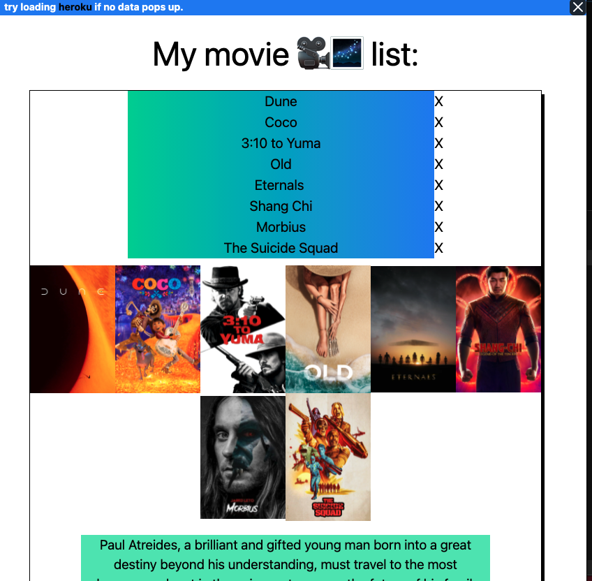

## readme

<!-- ## [Link](https://adnjoo.github.io/movie-app/) -->

> This app allows you to save your favorite movies.
>
> work in progress

  

Stack: PERN

Front end - Axios, HTML, CSS, React, Tailwind

APIs used - [TMDB](https://www.themoviedb.org/)

[Backend Github](https://github.com/adnjoo/movie-app-backend)

Work-flow - Trello (kanban/processes), Figma (mockups)

